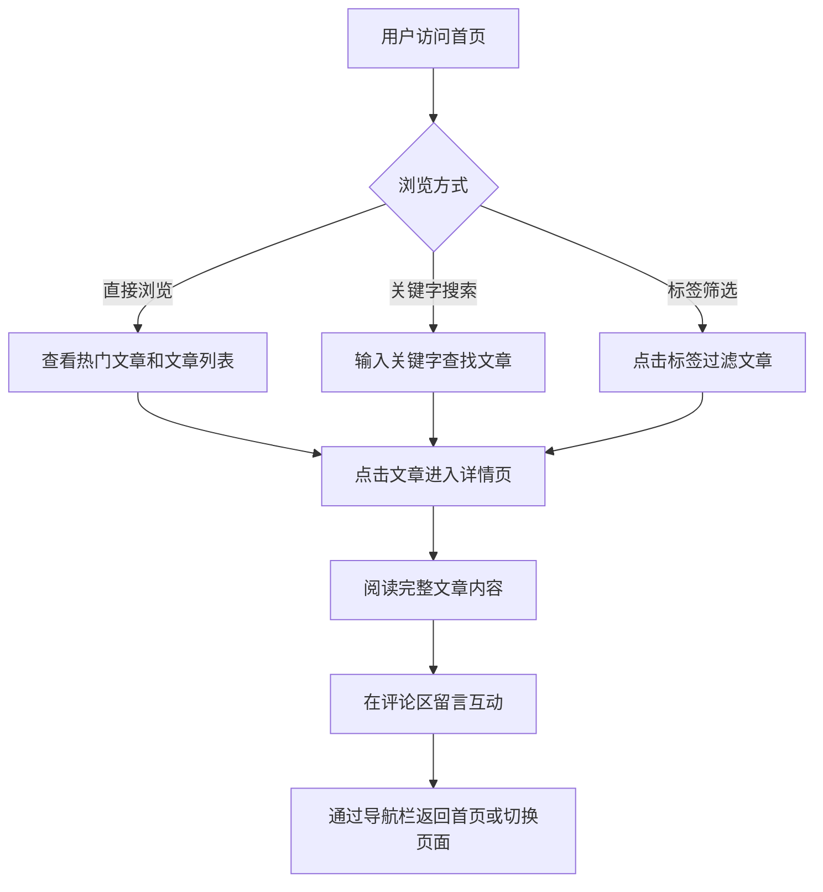

## 1. 产品概述
具有强烈科技感设计风格的个人知识分享与技术博客网站。
- 致力于为博主提供一个专业、酷炫的展示平台，同时方便读者进行文章搜索、分类筛选和互动交流。
- 采用深色模式和赛博朋克风格的 UI 元素，突显前沿技术氛围。

## 2. 核心功能

### 2.1 核心模块
1. **首页**: 顶部导航与搜索、热门文章推荐、标签筛选、文章列表。
2. **详情页**: 文章全文展示、用户留言评论区、简洁导航栏。

### 2.2 页面详情
| 页面名称 | 模块名称 | 功能描述 |
|-----------|-------------|---------------------|
| 首页 | 导航与搜索 | 顶部固定导航栏，包含关键字搜索框 |
| 首页 | 热门文章推荐 | 显示点赞量最高的文章的标题和摘要 |
| 首页 | 标签筛选区 | 允许用户按照标签（如前端、后端、AI等）进行筛选搜索 |
| 首页 | 文章列表 | 展示文章列表，点击标题或链接可跳转到详情页 |
| 详情页 | 文章内容区 | 完整展示文章的图文内容 |
| 详情页 | 评论区 | 用户可以在页面中留言评论，实现互动功能 |
| 详情页 | 导航栏 | 提供简洁的导航栏，方便用户在网站页面之间进行流畅切换 |

## 3. 核心流程
用户进入首页，浏览热门文章和最新列表；可通过搜索框或标签进行筛选；点击感兴趣的文章进入详情页；在详情页阅读文章并进行评论互动；通过导航栏快速返回首页或切换其他页面。

## 4. 用户界面设计
### 4.1 设计风格
- **主色调与辅助色**: 以深空黑（#0F172A 或 #000000）为背景，配合霓虹发光色（如荧光绿 #10B981、电光蓝 #3B82F6、赛博紫 #8B5CF6）作为强调色，营造浓郁的科技感和未来感。
- **按钮与控件风格**: 采用带有发光边框、悬浮微动效、毛玻璃（Glassmorphism）效果的现代化组件。
- **字体与排版**: 选用无衬线字体（如 Inter），配合等宽字体（如 Fira Code, Roboto Mono）展示代码或特殊数据，保持专业技术气息。
- **布局风格**: 网格化布局，信息呈现具有结构感和模块感。
- **图标/装饰**: 线条感强烈的几何图形、微小的网格背景图案、发光点缀。

### 4.2 页面设计概览
| 页面名称 | 模块名称 | UI 元素 |
|-----------|-------------|-------------|
| 首页 | 热门文章 | 大面积卡片，带有炫酷的发光边框和渐变背景，突出标题 |
| 首页 | 搜索与筛选 | 胶囊状搜索框，悬浮状态的发光标签按钮 |
| 首页 | 文章列表 | 响应式网格卡片，鼠标悬停时卡片微微上浮并改变边框颜色 |
| 详情页 | 文章内容 | 宽敞的阅读区，代码块采用深色主题及语法高亮，段落间距舒适 |
| 详情页 | 评论区 | 极简的输入框，带有流光边框的提交按钮，评论列表层级清晰 |

### 4.3 响应式设计
- 桌面端优先，大屏展示丰富的网格结构和全宽的科技感视觉元素。
- 移动端自适应，顶部导航自动收缩为汉堡菜单，文章列表转换为单列，保证阅读体验。