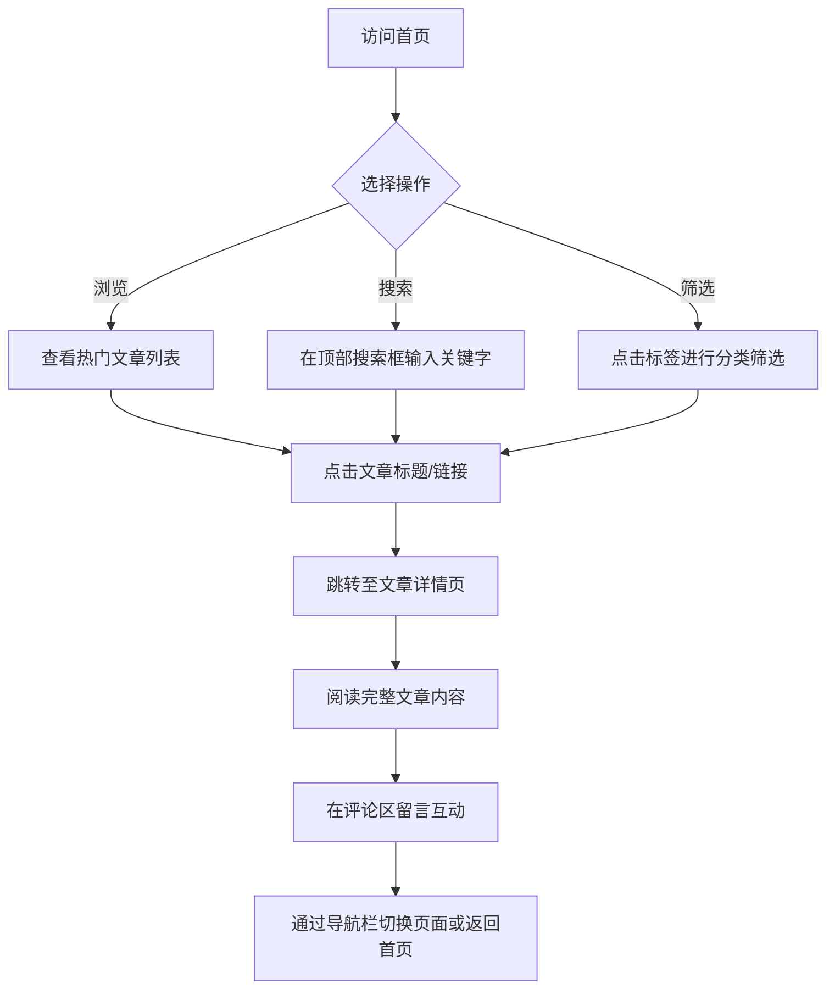

## 1. 产品概述
本项目旨在设计并创建一个具有强烈“科技感”的个人博客网站。该网站为用户提供流畅的阅读体验，核心聚焦于展示高质量内容、便捷的搜索与分类过滤，以及读者间的评论互动。整体设计将采用现代、深色系、带有未来主义风格的UI界面。

## 2. 核心功能

### 2.1 用户角色
| 角色 | 注册方式 | 核心权限 |
|------|----------|----------|
| 访客 | 无需注册 | 浏览文章、使用搜索与标签筛选、在详情页提交留言评论 |

### 2.2 功能模块
1. **全局导航栏**：包含网站Logo/名称、全局关键字搜索框、页面切换链接。
2. **首页**：热门文章列表（按点赞量排序，显示标题和摘要）、标签筛选器。
3. **文章详情页**：完整文章内容展示、评论留言互动区。

### 2.3 页面详情
| 页面名称 | 模块名称 | 功能描述 |
|----------|----------|----------|
| 首页 | 顶部导航栏 | 包含全局关键字搜索框，方便用户随时检索内容；提供简洁的页面切换链接 |
| 首页 | 标签筛选区 | 列出所有可用标签，点击标签可对下方的文章列表进行筛选过滤 |
| 首页 | 热门文章列表 | 默认展示点赞量最高的文章，每篇文章以卡片形式显示标题和摘要，点击可跳转详情 |
| 详情页 | 文章正文区 | 完整排版展示文章内容，保留科技感UI风格 |
| 详情页 | 评论互动区 | 用户可在页面下方输入昵称和评论内容进行留言，展示历史评论列表 |

## 3. 核心流程
访客进入网站首页，可通过顶部导航栏进行关键字搜索，或在标签区点击感兴趣的标签过滤文章。首页主体区域展示高点赞量的文章卡片。用户点击某篇文章的标题或卡片链接后，页面流畅跳转至对应的详情页。在详情页中，用户阅读完完整内容后，可在底部的留言区发布评论，与其他读者互动。随时可通过顶部导航栏返回首页或切换至其他功能页。

## 4. 用户界面设计

### 4.1 设计风格
- **色彩搭配**：主色调采用深色背景（如深渊黑 `#0D0D0D` 或深空蓝），搭配高对比度的科技霓虹色（如青色 `#00F0FF`、荧光紫 `#B026FF`）作为强调色、悬浮状态和按钮高亮。
- **UI元素样式**：广泛使用毛玻璃效果（Glassmorphism）、半透明背景配合背景模糊；卡片边缘使用细微的发光边框（Glow effect）。
- **字体排版**：标题采用具有几何感或等宽特性的无衬线字体（如 JetBrains Mono, Roboto Mono 或 Inter），正文采用清晰易读的无衬线字体。
- **布局风格**：网格对齐的现代化卡片式布局，保持充足的留白（Negative Space），视觉焦点集中。

### 4.2 页面设计概览
| 页面名称 | 模块名称 | UI 元素 |
|----------|----------|---------|
| 全局 | 导航栏 | 吸顶设计，半透明毛玻璃背景，霓虹色搜索框边框聚焦效果 |
| 首页 | 标签筛选 | 药丸状（Pill-shaped）标签按钮，选中时带有霓虹发光效果 |
| 首页 | 文章卡片 | 深色半透明卡片，悬浮时有轻微上浮动画及发光边框，标题科技感排版 |
| 详情页 | 正文区 | 宽幅沉浸式阅读区，代码块风格的引用或高亮装饰 |
| 详情页 | 评论区 | 极简输入框设计，提交按钮带有科技感的光效反馈，评论列表以对话气泡或卡片形式垂直排列 |

### 4.3 响应式设计
- 桌面端优先设计（Desktop-first），大屏下展示丰富的多列网格和宽幅导航栏。
- 移动端自适应，导航栏在小屏幕折叠为汉堡菜单，文章列表转换为单列流式布局，保证触控操作的便利性。
