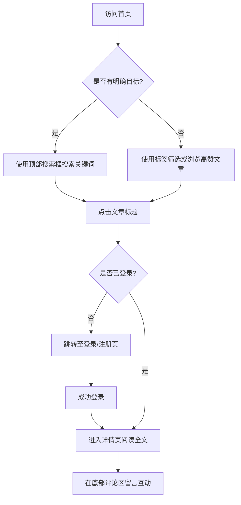

## 1. 产品概述
具有科技感的个人博客网站，旨在展示技术文章和个人思考，同时提供极客风格的阅读体验和用户互动功能。
- 目标：提供一个极具现代感、极客风的阅读体验，支持文章搜索、标签筛选以及评论互动。
- 价值：打造个人技术品牌，吸引开发者社区的关注，展示代码与设计能力。

## 2. 核心功能

### 2.1 用户角色
| 角色 | 注册方式 | 核心权限 |
|------|----------|----------|
| 访客 | 无需注册 | 浏览首页文章列表、搜索、标签筛选（**不能查看详情页**） |
| 普通用户 | 邮箱/账号注册 | 浏览文章详情、发表评论（支持简单昵称） |
| 管理员 | 预设账号 | 登录后台、文章管理（新增、编辑、保存、删除、发布） |

### 2.2 功能模块
1. **首页 (Home Page)**：顶部导航栏（含搜索框、登录/注册入口）、标签筛选区、高赞文章推荐区（根据点踩比例和可见度动态过滤）。
2. **文章详情页 (Details Page)**：需登录访问，包含可见度校验，完整文章内容展示、评论留言区、点赞与点踩功能。
3. **用户认证 (Authentication)**：用户注册、用户/管理员登录。
4. **后台管理 (Admin Dashboard)**：文章列表管理、文章编辑器（支持 Markdown 和 **可见度设置**）、用户管理（查看列表、最近登录时间、重置密码）、**文章分组管理（文件夹 CRUD）**。

### 2.3 页面详情
| 页面名称 | 模块名称 | 功能描述 |
|----------|----------|----------|
| 首页 | 顶部导航栏 | 包含Logo、全局搜索框，以及用户登录、注册的快捷入口。 |
| 首页 | 标签筛选区 | 展示所有文章标签，点击标签进行文章列表过滤。 |
| 首页 | 推荐文章列表 | 默认展示点赞量最高的文章列表，点击时如果未登录则跳转至登录页。**仅展示 `public` 和当前登录用户被授权查看的 `restricted` 文章。** |
| 详情页 | 文章阅读区 | **必须登录且具有查看权限才能访问**，否则提示无权限。 |
| 详情页 | 互动操作区 | 提供“点赞(Like)”和“点踩(Dislike)”按钮，点击可更新对应数值。 |
| 详情页 | 评论互动区 | 用户可输入内容并提交评论。 |
| 登录页 | 登录表单 | 支持普通用户和管理员登录，未注册用户可跳转至注册页。 |
| 注册页 | 注册表单 | 用户输入账号和密码进行注册。 |
| 后台首页 | 文件夹管理区 | 提供侧边栏管理文件夹（新增、重命名、删除），点击文件夹可过滤文章列表。 |
| 后台首页 | 文章列表管理 | 展示所有文章的列表（含状态和可见度标签），支持根据左侧选中的文件夹进行过滤，支持快速删除和编辑入口。 |
| 后台首页 | 用户管理 | 展示所有注册用户的列表，包含用户名、角色、最近登录时间。提供“重置密码”功能。 |
| 文章编辑器 | 内容编辑区 | 支持标题、摘要、标签的修改。**新增可见度配置（公开、私密、部分用户可见）。选择部分用户时，可指定授权的用户 ID 列表。** **新增归属文件夹选择**。提供保存（草稿）和发布功能。 |

## 3. 核心流程
用户与管理员访问网站的主要交互流程：

## 4. UI/UX 设计
### 4.1 设计风格 (科技感 / Tech-Vibe)
- **主色调**：深邃黑/深空灰（如 `#050505`, `#121212`），营造暗黑极客氛围。
- **点缀色**：赛博蓝（Cyan `#00F0FF`）、霓虹紫（Purple `#8A2BE2`），用于高亮、按钮、悬浮发光效果。
- **视觉风格**：Glassmorphism（毛玻璃/磨砂玻璃质感），半透明背景带细微的亮色边框，悬浮时有发光（Glow）效果。
- **字体**：标题和数字使用等宽字体（如 `Space Mono` 或系统自带的 Monospace），正文使用清晰的无衬线字体。
- **布局风格**：网格化（Grid）设计，背景可带有细微的网格线或点阵图。
- **动效**：页面切换时有平滑的淡入淡出，Hover时有霓虹闪烁的微交互。

### 4.2 页面设计规划
| 页面名称 | 模块名称 | UI 元素及设计要求 |
|----------|----------|-------------------|
| 首页 | 导航搜索栏 | 磨砂玻璃吸顶导航，搜索框带发光聚焦效果和科技感Icon。 |
| 首页 | 文章卡片 | 深色半透明背景，科技感边框，Hover时边框亮起霓虹色光晕。 |
| 详情页 | 正文区 | 高对比度阅读体验，排版清晰。 |
| 详情页 | 评论区 | 极简的输入框，线条风格，提交按钮带有科技感的微动效。 |

### 4.3 响应式设计
桌面端优先（Desktop-first），适配移动端（移动端导航栏折叠，文章列表转为单列，卡片发光效果适度减弱以提升性能）。