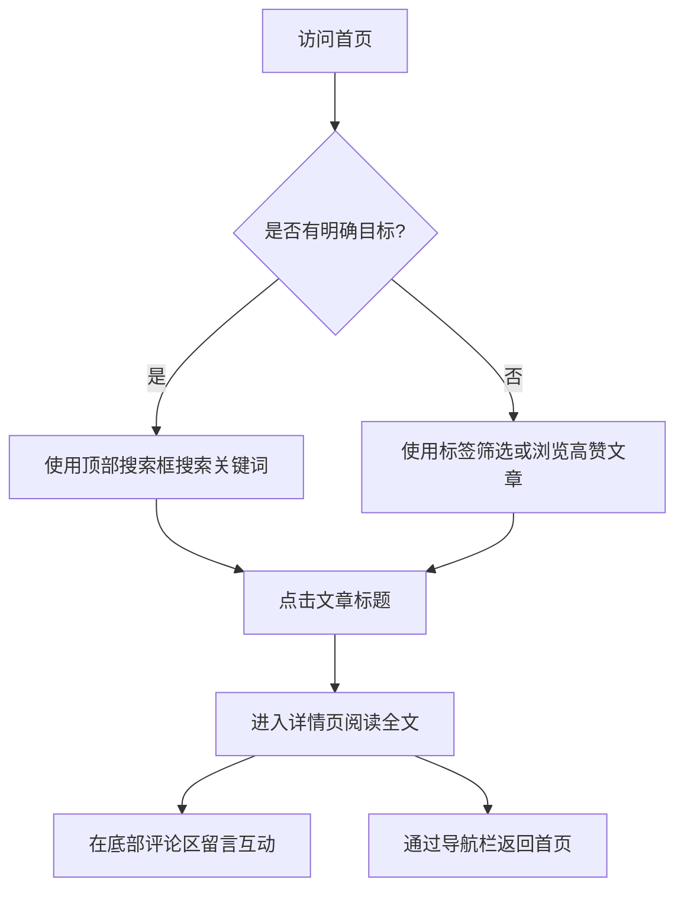

## 1. 产品概述
具有科技感的个人博客网站，旨在展示技术文章和个人思考，同时提供极客风格的阅读体验和用户互动功能。
- 目标：提供一个极具现代感、极客风的阅读体验，支持文章搜索、标签筛选以及评论互动。
- 价值：打造个人技术品牌，吸引开发者社区的关注，展示代码与设计能力。

## 2. 核心功能

### 2.1 用户角色
| 角色 | 注册方式 | 核心权限 |
|------|----------|----------|
| 访客 | 无需注册 | 浏览文章、搜索、标签筛选、发表评论（支持简单昵称） |

### 2.2 功能模块
1. **首页 (Home Page)**：顶部导航栏（含搜索框）、标签筛选区、高赞文章推荐区（标题与摘要展示）。
2. **文章详情页 (Details Page)**：完整文章内容展示、评论留言区、平滑的页面切换导航。

### 2.3 页面详情
| 页面名称 | 模块名称 | 功能描述 |
|----------|----------|----------|
| 首页 | 顶部导航栏 | 包含Logo、全局搜索框，支持关键字实时过滤文章。 |
| 首页 | 标签筛选区 | 展示所有文章标签，点击标签进行文章列表过滤。 |
| 首页 | 推荐文章列表 | 默认展示点赞量最高的文章列表，包含标题、摘要、阅读量/点赞量、标签，点击跳转详情。 |
| 详情页 | 文章阅读区 | 完整展示文章的标题、作者、发布时间及正文内容（高对比度排版）。 |
| 详情页 | 评论互动区 | 用户可输入昵称和评论内容并提交，展示当前文章的历史留言。 |
| 详情页 | 侧边/顶部导航 | 简洁的导航栏，支持快速返回首页。 |

## 3. 核心流程
用户访问网站的主要交互流程：

## 4. UI/UX 设计
### 4.1 设计风格 (科技感 / Tech-Vibe)
- **主色调**：深邃黑/深空灰（如 `#050505`, `#121212`），营造暗黑极客氛围。
- **点缀色**：赛博蓝（Cyan `#00F0FF`）、霓虹紫（Purple `#8A2BE2`），用于高亮、按钮、悬浮发光效果。
- **视觉风格**：Glassmorphism（毛玻璃/磨砂玻璃质感），半透明背景带细微的亮色边框，悬浮时有发光（Glow）效果。
- **字体**：标题和数字使用等宽字体（如 `Space Mono` 或系统自带的 Monospace），正文使用清晰的无衬线字体。
- **布局风格**：网格化（Grid）设计，背景可带有细微的网格线或点阵图。
- **动效**：页面切换时有平滑的淡入淡出，Hover时有霓虹闪烁的微交互。

### 4.2 页面设计规划
| 页面名称 | 模块名称 | UI 元素及设计要求 |
|----------|----------|-------------------|
| 首页 | 导航搜索栏 | 磨砂玻璃吸顶导航，搜索框带发光聚焦效果和科技感Icon。 |
| 首页 | 文章卡片 | 深色半透明背景，科技感边框，Hover时边框亮起霓虹色光晕。 |
| 详情页 | 正文区 | 高对比度阅读体验，排版清晰。 |
| 详情页 | 评论区 | 极简的输入框，线条风格，提交按钮带有科技感的微动效。 |

### 4.3 响应式设计
桌面端优先（Desktop-first），适配移动端（移动端导航栏折叠，文章列表转为单列，卡片发光效果适度减弱以提升性能）。