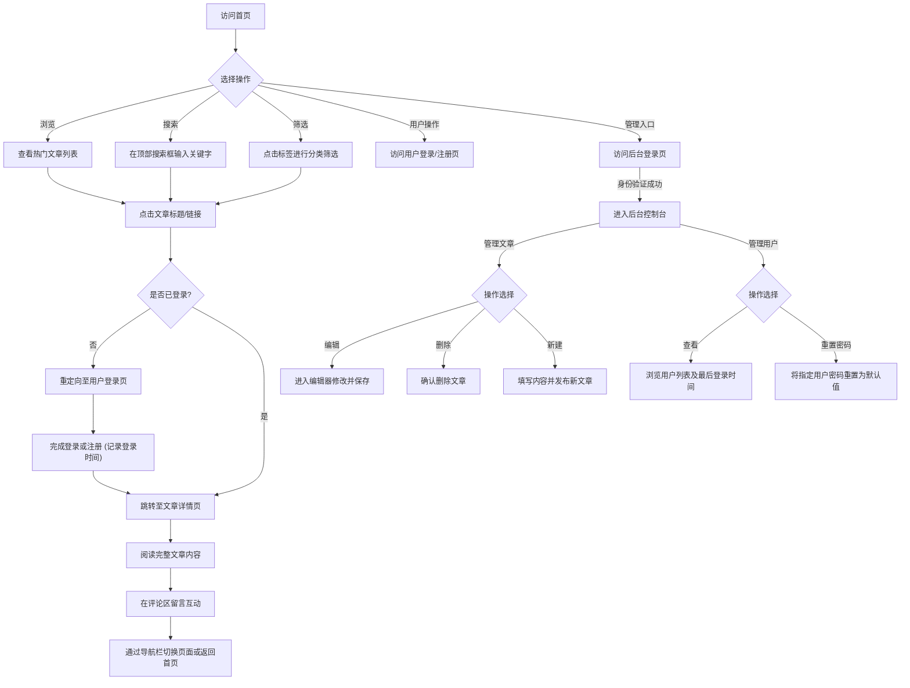

## 1. 产品概述
本项目旨在设计并创建一个具有强烈“科技感”的个人博客网站。该网站为用户提供流畅的阅读体验，核心聚焦于展示高质量内容、便捷的搜索与分类过滤，以及读者间的评论互动。整体设计将采用现代、深色系、带有未来主义风格的UI界面。

## 2. 核心功能

### 2.1 用户角色
| 角色 | 注册方式 | 核心权限 |
|------|----------|----------|
| 访客 | 无需注册 | 浏览首页热门文章列表和搜索、筛选功能 |
| 注册用户 | 账号密码注册 | 登录后可访问文章详情页阅读完整内容，并提交留言评论 |
| 管理员 | 预设密码 | 登录后台系统，进行文章和用户的全面管理（包含文章发布/编辑/删除，以及用户列表查看、最后登录时间查看、重置密码等） |

### 2.2 功能模块
1. **全局导航栏**：包含网站Logo/名称、全局关键字搜索框、用户登录/注册入口或用户信息、后台入口。
2. **首页**：热门文章列表（按点赞量排序，显示标题和摘要）、标签筛选器。
3. **用户认证模块**：用户注册页面、用户登录页面（记录最近一次登录时间）。
4. **文章详情页**：完整文章内容展示、评论留言互动区（需登录访问）。
5. **后台管理模块**：管理员登录页面、后台控制台（包含文章管理和用户管理选项卡）、文章编辑与发布页面。

### 2.3 页面详情
| 页面名称 | 模块名称 | 功能描述 |
|----------|----------|----------|
| 首页 | 顶部导航栏 | 包含全局关键字搜索框、用户登录/注册链接（未登录）或用户昵称（已登录）及注销功能 |
| 首页 | 标签筛选区 | 列出所有可用标签，点击标签可对下方的文章列表进行筛选过滤 |
| 首页 | 热门文章列表 | 默认展示点赞量最高的文章，每篇文章以卡片形式显示标题和摘要，点击可跳转详情 |
| 用户注册页 | 注册表单 | 用户输入用户名和密码创建新账号 |
| 用户登录页 | 登录表单 | 用户输入凭证登录系统，未登录时尝试访问详情页会被重定向至此，登录成功后更新最近登录时间 |
| 详情页 | 文章正文区 | 完整排版展示文章内容，保留科技感UI风格（受保护页面） |
| 详情页 | 评论互动区 | 用户可在页面下方输入昵称和评论内容进行留言，展示历史评论列表 |
| 后台登录页 | 登录表单 | 管理员通过预设凭证登录，获取后台管理权限 |
| 后台控制台 | 文章管理列表 | 展示所有文章列表，支持快速删除操作，并提供“新建文章”入口 |
| 后台控制台 | 用户管理列表 | 展示所有注册用户列表，显示用户名、注册时间和最近一次登录时间，提供重置密码操作 |
| 文章编辑器 | 内容编辑表单 | 支持输入标题、摘要、标签以及Markdown/纯文本内容，提供保存/发布功能 |

## 3. 核心流程
访客进入网站首页，可通过顶部导航栏进行关键字搜索或标签过滤文章，并浏览文章摘要。若访客点击文章标题尝试阅读详情，将被重定向至用户登录页。访客可选择注册新账号或直接登录。登录成功后系统记录其最后登录时间，用户即可顺利进入文章详情页，阅读完整内容并在评论区与其他读者互动。
管理员可通过特定入口进入登录页，验证身份后进入后台控制台。在控制台中可以在“文章管理”和“用户管理”两个选项卡之间切换，进行文章的增删改查操作，或者查看用户列表并重置指定用户的密码。

## 4. 用户界面设计

### 4.1 设计风格
- **色彩搭配**：主色调采用深色背景（如深渊黑 `#0D0D0D` 或深空蓝），搭配高对比度的科技霓虹色（如青色 `#00F0FF`、荧光紫 `#B026FF`）作为强调色、悬浮状态和按钮高亮。
- **UI元素样式**：广泛使用毛玻璃效果（Glassmorphism）、半透明背景配合背景模糊；卡片边缘使用细微的发光边框（Glow effect）。
- **字体排版**：标题采用具有几何感或等宽特性的无衬线字体（如 JetBrains Mono, Roboto Mono 或 Inter），正文采用清晰易读的无衬线字体。
- **布局风格**：网格对齐的现代化卡片式布局，保持充足的留白（Negative Space），视觉焦点集中。

### 4.2 页面设计概览
| 页面名称 | 模块名称 | UI 元素 |
|----------|----------|---------|
| 全局 | 导航栏 | 吸顶设计，半透明毛玻璃背景，霓虹色搜索框边框聚焦效果 |
| 首页 | 标签筛选 | 药丸状（Pill-shaped）标签按钮，选中时带有霓虹发光效果 |
| 首页 | 文章卡片 | 深色半透明卡片，悬浮时有轻微上浮动画及发光边框，标题科技感排版 |
| 详情页 | 正文区 | 宽幅沉浸式阅读区，代码块风格的引用或高亮装饰 |
| 详情页 | 评论区 | 极简输入框设计，提交按钮带有科技感的光效反馈，评论列表以对话气泡或卡片形式垂直排列 |

### 4.3 响应式设计
- 桌面端优先设计（Desktop-first），大屏下展示丰富的多列网格和宽幅导航栏。
- 移动端自适应，导航栏在小屏幕折叠为汉堡菜单，文章列表转换为单列流式布局，保证触控操作的便利性。
