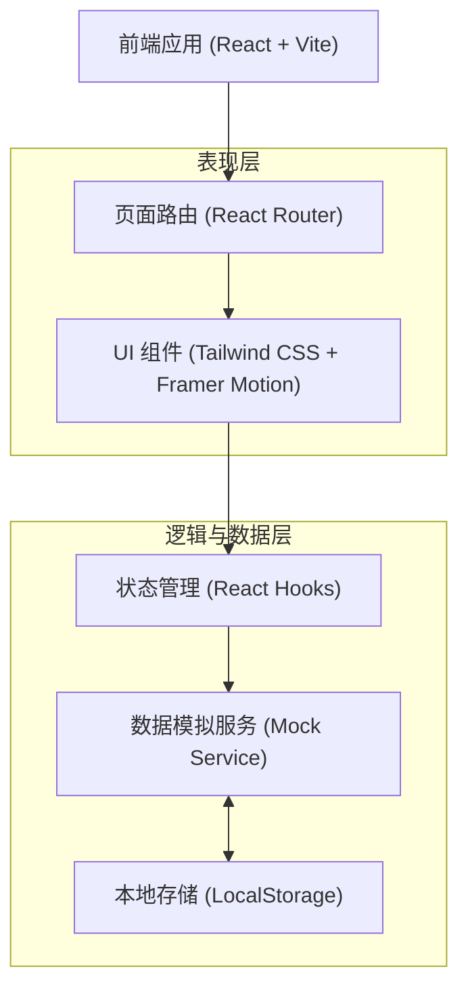

## 1. 架构设计
本项目采用纯前端架构实现，通过浏览器的 LocalStorage 来模拟后端数据库，实现文章点赞、搜索、标签过滤以及评论的持久化存储，无需部署真实的后端服务。



## 2. 技术说明
- **核心框架**: React@18
- **构建工具**: Vite (提供极速的本地开发和构建体验)
- **样式方案**: Tailwind CSS@3 (通过原子化 CSS 快速构建毛玻璃、霓虹发光等科技感 UI)
- **路由管理**: React Router DOM v6 (处理首页与详情页之间的流畅切换)
- **动画库**: Framer Motion (用于页面切换、卡片悬浮、列表加载等平滑且具科技感的交互动画)
- **图标库**: Lucide React (提供简洁现代、可高度自定义的矢量图标)

## 3. 路由定义
| 路由 | 目的 |
|------|------|
| `/` | 首页：展示顶部导航（含搜索）、标签筛选器、以及按点赞量排序的文章列表 |
| `/login` | 用户登录页：输入账号密码进行普通用户身份验证 |
| `/register` | 用户注册页：创建新的普通用户账号 |
| `/article/:id` | 详情页：展示完整正文内容，并提供评论互动区（受普通用户保护的路由） |
| `/admin/login` | 管理员登录页：提供预设密码验证 |
| `/admin` | 后台控制台：展示文章列表，提供编辑、删除、新建入口（受管理员保护的路由） |
| `/admin/editor/:id?` | 文章编辑器：用于创建新文章或编辑现有文章（受管理员保护的路由） |

## 4. 数据模型 (前端模拟)
应用将在首次加载时向 LocalStorage 注入预设的文章数据，并处理管理员及普通用户的身份验证状态。

### 4.1 数据模型定义
```typescript
// 认证状态 (存于 Zustand)
interface AuthState {
  isAdminAuthenticated: boolean;
  user: User | null;
}

// 用户模型
interface User {
  id: string;
  username: string;
  passwordHash: string; // 模拟简单加密或明文
  createdAt: string;
}

// 文章模型
interface Article {
  id: string;
  title: string;
  summary: string;
  content: string;
  likes: number;      // 点赞量
  tags: string[];     // 关联标签
  createdAt: string;  // 发布时间
}

// 评论模型
interface Comment {
  id: string;
  articleId: string;  // 关联的文章 ID
  username: string;   // 评论者昵称
  text: string;       // 评论内容
  createdAt: string;  // 评论时间
}
```

### 4.2 数据流转说明
- **文章加载与筛选**：页面初始化时从 LocalStorage 读取 `Article` 列表，在首页通过计算属性实现按 `likes` 降序排列。搜索框输入关键字时，对 `title` 和 `summary` 进行模糊匹配；点击标签时，对 `tags` 数组进行精确过滤。
- **评论发布**：在详情页，用户提交表单后生成新的 `Comment` 对象，追加到 LocalStorage 中的评论列表，并触发页面更新显示最新留言。
- **后台管理**：管理员在登录页输入凭证（如简单的硬编码密码），验证通过后在 Zustand 存储认证状态。进入受保护的 `/admin` 路由后，可调用数据层的 `createArticle`, `updateArticle`, `deleteArticle` 方法直接修改 LocalStorage，并实时反馈至页面。
