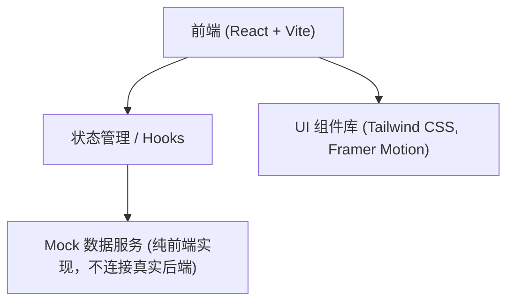
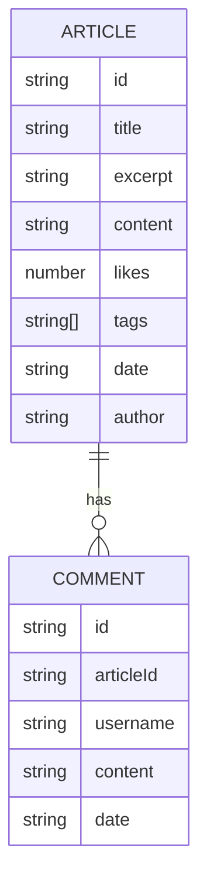

## 1. 架构设计

## 2. 技术说明
- **前端框架**: React@18 + Vite
- **样式方案**: Tailwind CSS (支持高度定制的科技感样式、深色模式和发光效果)
- **动画库**: Framer Motion (实现流畅的页面路由切换、卡片悬浮和入场微动效)
- **路由管理**: React Router v6
- **图标库**: Lucide React
- **开发与构建**: 采用 `npm create vite@latest . -- --template react-ts --yes` 方式进行脚手架初始化
- **依赖说明**: 由于用户要求不连接 Supabase，所有数据请求将通过本地 Mock 数据和 LocalStorage 进行模拟（如评论功能）。

## 3. 路由定义
| 路由路径 | 页面说明 |
|-------|---------|
| `/` | 博客首页（热门推荐、搜索、标签筛选、文章列表） |
| `/article/:id` | 文章详情页（完整文章内容、评论区） |

## 4. 数据模型 (Mock 数据结构)

由于不使用真实的后端服务，前端将维护一份结构化的 Mock 数据来驱动页面展示。

### 4.1 数据模型定义

### 4.2 核心逻辑实现说明
- **热门文章推荐**: 在首页渲染前，通过数组的 `sort` 方法对 `likes` 字段进行降序排序，提取排名第一的文章作为头部展示。
- **关键字与标签搜索**: 搜索框通过输入的关键字过滤 `title` 和 `excerpt`；标签点击通过过滤 `tags` 数组实现；两者可结合使用。
- **评论功能**: 用户的留言评论暂时存放在 React 状态中，或使用浏览器的 LocalStorage 持久化，以便在页面刷新后仍能显示用户刚才的互动。