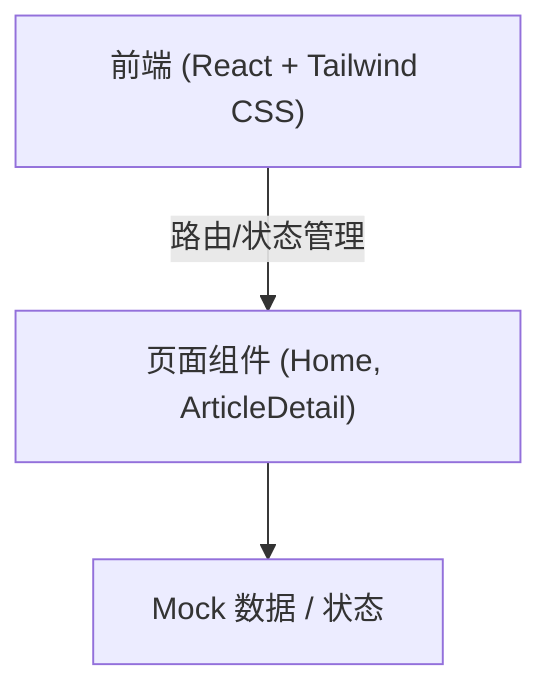

## 1. 架构设计
前端单页应用（SPA）架构，使用 Mock 数据模拟后端接口。



## 2. 技术说明
- **前端框架**: React 18 + Vite
- **样式方案**: Tailwind CSS 3 (用于快速实现科技感样式和响应式布局) + 自定义 CSS Variables (用于发光、毛玻璃等复杂动效)
- **路由**: React Router DOM 6
- **图标**: Lucide React
- **动效**: Framer Motion (用于页面切换、悬浮发光、平滑过渡等科技感动画)
- **状态管理**: React Hooks (useState, useEffect) 结合 Mock 数据模拟

## 3. 路由定义
| 路由 | 用途 |
|------|------|
| `/` | 首页：展示搜索框、标签筛选和高赞文章列表 |
| `/article/:id` | 详情页：展示文章全文、评论区及快捷导航 |

## 4. 数据模型 (Mock)
无需真实后端，前端采用 Mock 数据结构来模拟所有交互功能：

**文章 (Article)**
```typescript
interface Article {
  id: string;
  title: string;
  summary: string;
  content: string; // 模拟 Markdown 解析后的 HTML 字符串或直接长文本
  tags: string[];
  likes: number;
  views: number;
  date: string;
}
```

**评论 (Comment)**
```typescript
interface Comment {
  id: string;
  articleId: string;
  author: string;
  content: string;
  date: string;
}
```