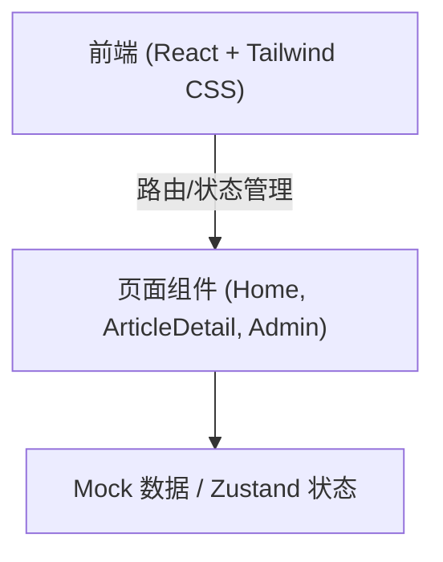

## 1. 架构设计
前端单页应用（SPA）架构，使用 Mock 数据模拟后端接口。



## 2. 技术说明
- **前端框架**: React 18 + Vite
- **样式方案**: Tailwind CSS 3 (用于快速实现科技感样式和响应式布局) + 自定义 CSS Variables (用于发光、毛玻璃等复杂动效)
- **路由**: React Router DOM 6 (含 PrivateRoute 保护管理端)
- **图标**: Lucide React
- **动效**: Framer Motion (用于页面切换、悬浮发光、平滑过渡等科技感动画)
- **状态管理**: Zustand (结合 LocalStorage 模拟持久化登录状态与数据修改)

## 3. 路由定义
| 路由 | 用途 |
|------|------|
| `/` | 首页：展示搜索框、标签筛选和高赞文章列表 |
| `/article/:id` | 详情页：展示文章全文、评论区及快捷导航（需登录访问） |
| `/login` | 用户/管理员登录页 |
| `/register` | 普通用户注册页 |
| `/admin` | 管理后台主页（需鉴权）：展示文章列表管理与用户管理（多 Tab 切换） |
| `/admin/editor/:id?` | 文章编辑器（需鉴权）：新建或编辑文章 |

## 4. 数据模型 (Mock)
无需真实后端，前端采用 Mock 数据结构结合 Zustand 状态来模拟所有交互功能：

**用户 (User)**
```typescript
interface User {
  id: string;
  username: string;
  password?: string; // 仅模拟，实际项目应加密
  role: 'user' | 'admin';
  lastLogin?: string; // 最近一次登录时间
}
```

**文件夹 (Folder)**
```typescript
interface Folder {
  id: string;
  name: string;
  createdAt: string;
}
```

**文章 (Article)**
```typescript
interface Article {
  id: string;
  title: string;
  summary: string;
  content: string; // 模拟 Markdown 解析后的 HTML 字符串或直接长文本
  tags: string[];
  likes: number;
  dislikes: number; // 点踩数量
  views: number;
  date: string;
  status: 'draft' | 'published'; // 新增状态字段
  visibility: 'public' | 'private' | 'restricted'; // 可见度配置
  allowedUsers?: string[]; // 当 visibility 为 restricted 时，允许访问的用户 ID 列表
  folderId?: string | null; // 归属文件夹 ID
  authorId?: string; // 创建者的 User ID，用于注销时判断是否有资产
}
```

**评论 (Comment)**
```typescript
interface Comment {
  id: string;
  articleId: string;
  author: string;
  content: string;
  date: string;
}
```